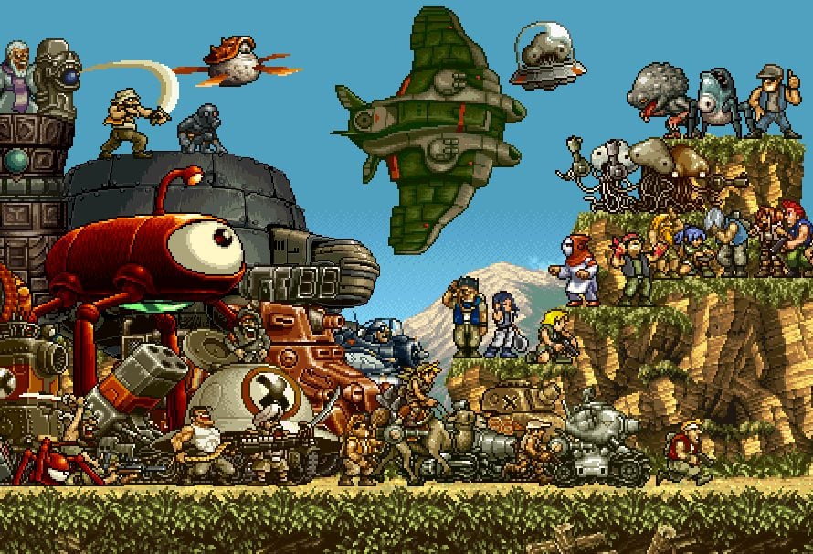
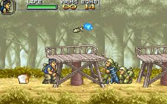
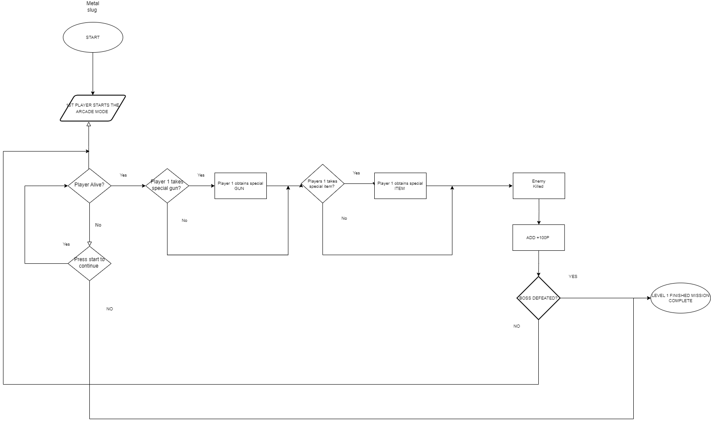
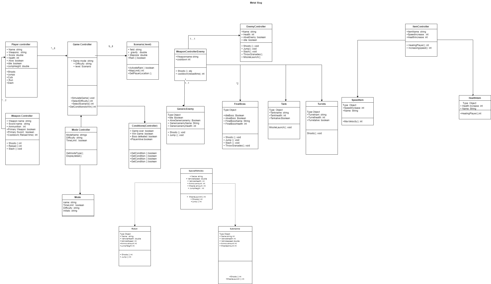
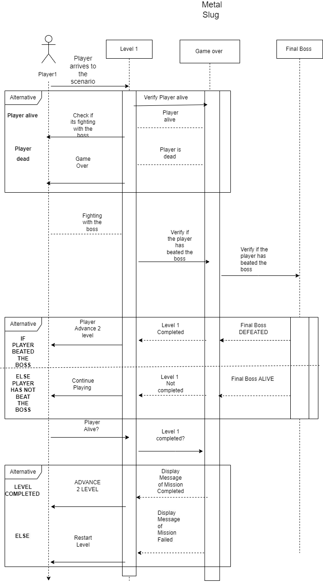

## Final Project
METAL SLUG 

## Proposal

---

Metal slug is a ***run and gun game*** with simple mechanics to learn how to design a proper Class diagram and flowcharts, due the industry seems to like 2D platformers and its the kind of games of my preference and the type i'd like to develop in the near future ive choosen it.
 
- [How does the gameplay look like?](#Similar-games)

---
## User story

The design of the project will include detailed information of the basic mechanics of the game having as example the first level of the game  (this will include the scheme of the game, player, map, difficulty, weapons, etc). 
At the start of the game the user will have introduce the type of mode he wants to play to after select the difficulty of the game and the level once the game has started the palyer will appear in the first level with one weapon and one sword, full health and unlimited ammunition, while the ***player advance through the 2D scenario*** he'll be able to shoot the enemies and earn 100 points for each enemy defeated, in addition some enemies will throw a machine gun randomly that can be taken for the player to shoot faster and cause more damage. The conditions finalize the game willl be that the player has health remaining and has defeated the boss. Theres not an specific amount of points required to pass the level 
>Gameplay example
>[Metal slug gameplay](https://www.youtube.com/watch?v=JCBzUXvy7sI " Metal slug example")

---
## Similar games
- Cuphead
- Contra
- Megaman Zero
- Azure Strike Gunvolt
- Sunset Riders

---

## Flowchart 

---

## Class Diagram

---

## Sequence Diagram

## GITHUB REPOSITORY
---
>[Full Project on GitHunb ](https://github.com/LeonEM0/VersionControl/tree/main")